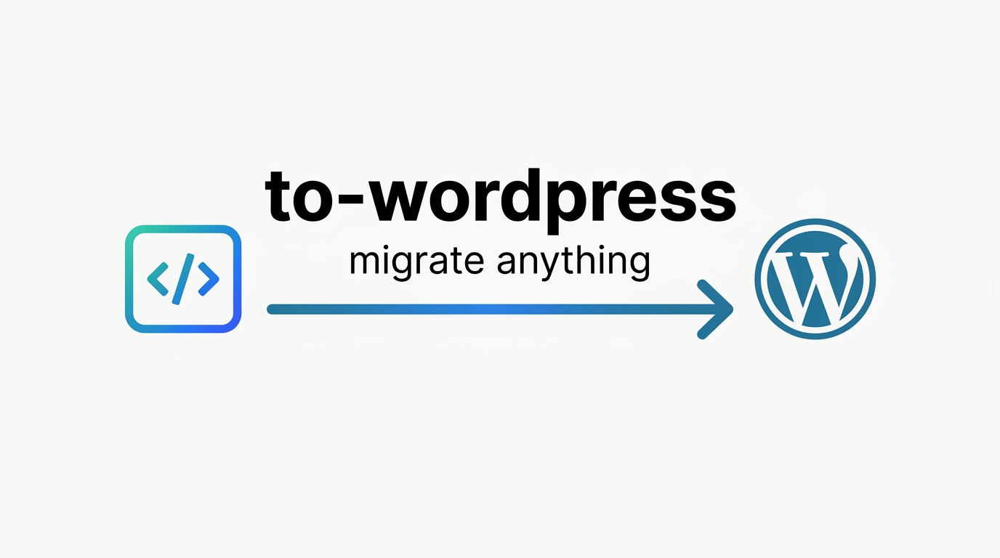
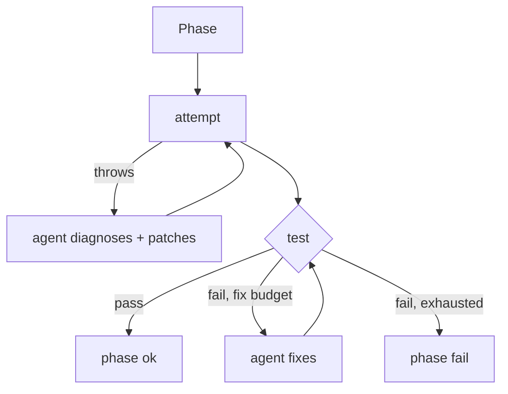

<div align="center">



**Migrate anything text-shaped to WordPress — driven by your AI coding agent of choice.**

Point it at a Jekyll / Hugo / Eleventy / Gatsby / Next / Astro / Hexo /
Docusaurus / MkDocs site, a WordPress WXR export, a Medium or Substack
export, a folder of Word documents, a spreadsheet of rows, a library of
PDFs, an EPUB, a GitHub repo README, a pile of markdown notes, or plain
`.txt` files. Walk away. Come back to a fully working, pixel-close
WordPress under
[`wp-env`](https://developer.wordpress.org/block-editor/getting-started/devenv/get-started-with-wp-env/)
with a **block theme (FSE)**, a site plugin that replicates every
SSG-level plugin and custom endpoint, imported content and media,
preserved permalinks, legacy shortcodes turned into real **Gutenberg
blocks**, and an autonomous **attempt → test → fix** verification loop.

[](https://www.npmjs.com/package/to-wordpress)
[](https://www.npmjs.com/package/to-wordpress)
[](./LICENSE)
[](https://nodejs.org)

[Install](#install) · [Quick start](#quick-start) · [Agents](#agents) · [How it works](#how-it-works) · [Supported sources](#supported-sources) · [CLI](#cli) · [FAQ](#faq)

</div>

---

## Why

Moving a content-heavy static site to WordPress by hand is a week of
template translation, shortcode rewrites, data shuffling, and URL
remapping. `to-wordpress` collapses that into one command: a
deterministic TypeScript pipeline drives your chosen AI coding agent —
**GitHub Copilot CLI**, **Claude Code**, or **OpenAI Codex** — in a
hybrid orchestration. The tool owns phase transitions, file I/O,
verification, and retries; the agent handles the creative parts
(templates, custom blocks, edge-case normalization, diagnosis and
repair on failure).

What lands in `wp-content/`:

- A bespoke **block theme** (FSE) — `templates/*.html`, `parts/*.html`,
  `theme.json` v3, matching your source DOM.
- A **site plugin** replicating every non-theme concern including
  **custom SSG plugins and endpoints** (Jekyll `_plugins/*.rb` →
  WordPress rewrite rules + dynamic templates; `/llm/` endpoints,
  generators, category pages, custom feeds).
- Legacy source shortcodes **converted into real Gutenberg blocks**
  (block.json apiVersion 3, `render.php`, `edit.js`, `style.css`) —
  content is rewritten to use native block markup, not `[shortcode]`
  fallbacks.
- Posts, pages, terms, menus, users, featured images — imported via
  `wp-cli` with original permalinks preserved by default.
- A self-written [`WORDPRESS_MIGRATION.md`](#the-migration-doc) that
  documents every decision so you can audit or replay the run.

Every phase runs as an **autonomous agentic loop** — attempt, test,
fix, repeat. No user prompts. If a phase crashes, the agent is handed
the error + recent logs and asked to repair before the next retry.

## Install

`to-wordpress` is meant for one-shot runs, so use `npx` — no global
install needed:

```bash
npx to-wordpress ./path/to/your-site
```

Or install globally if you iterate on the same source:

```bash
npm install -g to-wordpress
to-wordpress ./path/to/your-site
```

### Requirements

- **Node.js ≥ 20**
- **Docker** (for [`wp-env`](https://developer.wordpress.org/block-editor/getting-started/devenv/get-started-with-wp-env/) and the source-prerender container)
- **At least one AI agent CLI** — pick whichever you already pay for:
  - **GitHub Copilot CLI** (`copilot`): `brew install --cask github-copilot-cli` then `copilot login`
  - **Claude Code** (`claude`): [docs.anthropic.com/claude/docs/claude-code](https://docs.anthropic.com/claude/docs/claude-code)
  - **OpenAI Codex CLI** (`codex`): [github.com/openai/codex](https://github.com/openai/codex)

The tool is self-contained otherwise — no Ruby, no PHP, no wp-cli on
the host. `wp-env` runs WordPress in Docker and the tool talks to
wp-cli through it.

## Quick start

```bash
# 1. Clone or cd into any static site
git clone https://github.com/you/your-jekyll-site
cd your-jekyll-site

# 2. Run the migration (default agent: claude)
npx to-wordpress .

# 3. Open the result
open http://localhost:8888
```

Prefer GitHub Copilot?

```bash
npx to-wordpress . --agent copilot
```

Prefer Codex?

```bash
npx to-wordpress . --agent codex
```

When it finishes you'll have:

```
your-jekyll-site/
├── .wp-env.json              # theme + plugin + content mounted into WordPress
├── WORDPRESS_MIGRATION.md    # the plan + per-phase status + state block
└── WORDPRESS_MIGRATION/
    ├── theme/                # generated block theme (FSE)
    │   ├── style.css
    │   ├── theme.json        # version 3 — presets, fonts, templateParts
    │   ├── functions.php
    │   ├── templates/        # HTML block templates
    │   ├── parts/            # header.html, footer.html, …
    │   └── patterns/         # filesystem block patterns
    ├── plugin/               # site plugin
    │   ├── <slug>.php        # bootstrap only (header + include loop)
    │   ├── includes/         # cpt.php, endpoints.php, redirects.php, …
    │   └── blocks/           # Gutenberg blocks generated by blockify
    ├── content/              # canonical markdown with block markup
    ├── media/                # collected image assets
    ├── rendered/             # prerender output (ground truth)
    ├── import-manifest.json  # exact payload fed to wp-cli
    ├── blocks.json           # manifest of blocks blockify generated
    ├── shortcodes.json       # legacy shortcode names (for back-compat)
    ├── redirects.json        # old-path → new-path map
    └── verify-report.json    # URL parity + count diff from the last run
```

## Agents

Pick your agent via the `--agent` flag or the `TOWP_AGENT` env var.
Every phase is agent-agnostic — the same prompts drive any of them,
and the TUI renders events uniformly.

| Agent | Flag | Model default | Override env |
|---|---|---|---|
| Claude Code | `--agent claude` (default) | `claude-sonnet-4-5` | `CLAUDE_MODEL` |
| GitHub Copilot CLI | `--agent copilot` | `gpt-5.4` | `COPILOT_MODEL`, `COPILOT_EFFORT` |
| OpenAI Codex CLI | `--agent codex` | (agent's own default) | `CODEX_MODEL` |

```bash
# One-off override
npx to-wordpress . --agent copilot

# Sticky selection via env
export TOWP_AGENT=codex
npx to-wordpress .

# Specific model (claude is the default, override its model)
CLAUDE_MODEL=claude-opus-4-5 npx to-wordpress .
```

Adding a new agent is a small file under
[`src/agents/`](./src/agents/) implementing one `AgentSpec` interface
(binary, arg builder, event parser).

## How it works


Every phase runs through a generic **agentic loop**:



No user prompts. Every retry decision, every repair invocation, every
fix-pass is parametric via `--max-attempts`, `--max-fix-passes`, and
`--fail-strategy`.

| # | Phase | What it does |
|---|---|---|
| 1 | **Detect** | Probes the source with one [detector per SSG](./src/detectors/). Falls back to a Copilot/Claude/Codex-driven freestyle detector that reads files and **never skips a folder**. |
| 2 | **Plan** | Produces `WORDPRESS_MIGRATION.md` with a template map, a feature-to-plugin map, permalink structure, and acceptance criteria. Fully parametric — all choices come from CLI flags with sensible auto-detected defaults. |
| 3 | **Boot wp-env** | Writes `.wp-env.json`, mounts your theme + plugin + work dir, runs `npx wp-env start`, verifies `GET /` returns 200. |
| 4 | **Theme** | Builds the source to capture **ground-truth HTML**, mirrors `_sass/`, `assets/`, `_data/`, `_layouts/`, `_includes/` into the theme dir, then drives the agent to emit a **block theme** — `theme.json` v3, HTML block templates, patterns, `functions.php` — whose DOM matches the reference. |
| 5 | **Normalize** | Turns every post/page into canonical markdown with a fixed front-matter schema. Unusual cases are handed to the agent with a strict edge-case prompt. Emits `shortcodes.json` listing every Liquid include found in content. |
| 6 | **Blockify** | For every unique shortcode, the agent generates a proper Gutenberg block (`block.json` apiVersion 3 + `render.php` + `edit.js` + `style.css`) under `plugin/blocks/<name>/`. Content files are then deterministically rewritten: `[wpify_figure src="…"]` becomes `<!-- wp:theme-slug/figure {"src":"…"} /-->`. |
| 7 | **Plugin** | Generates a site plugin covering CPTs, taxonomies, custom REST routes, **SSG-plugin replication** (Jekyll `_plugins/*.rb` generators and custom endpoints like `/llm/` ported to WordPress rewrite rules + dynamic templates), comments, analytics, cookie banner, redirects, options page. Registers all the blocks blockify produced. |
| 8 | **Import** | Runs a generated PHP script via `wp eval-file` inside the container to upsert posts, terms, menus, users, and media; sets `show_on_front`; populates the primary menu from `_data/menu.yml`. |
| 9 | **Verify** | Counts posts per type with wp-cli, fetches a sample of source URLs, diffs titles / H1s / HTTP status. Writes `verify-report.json`. Runs its own internal fix loop: on failure, feeds the report to the agent for surgical edits + re-verifies until clean or the fix budget is exhausted. |
| 10 | **Testfix** | HTTP endpoint sweep against the live WordPress (up to 60 paths: `/`, blog index, originalPermalinks from `index.json`). 404/500/timeouts/fatal-error HTML markers trigger an agent-driven fix pass up to `--max-fix-passes` times. |

### Autonomous retries

Every phase respects the same retry/repair contract:

- On **crash**: the agent is given the error message + the last 120
  lines of logs and asked to make a surgical repair. Retry up to
  `--max-attempts` (default 3).
- On **test fail**: the test result report (structured JSON) is fed
  back to the agent with the fix prompt. Retry up to
  `--max-fix-passes` (default 3).
- On **exhaustion**: behavior controlled by `--fail-strategy`:
  - `continue` (default) — mark phase failed, proceed to next.
  - `skip` — mark phase skipped, proceed to next.
  - `abort` — stop the migration with exit code 2.

No user input needed at any point. Good for CI.

## Supported sources

`to-wordpress` ships detectors for every shape of content we've seen —
from real SSGs down to "a folder of PDFs". Each detector emits a
**detector briefing** that steers the theme, plugin, plan, and
normalize phases; binary/tabular formats are first routed through a
per-format conversion prompt (see [`src/prompts/convert-*.md`](./src/prompts/))
that turns the raw source into canonical markdown before the rest of
the pipeline runs.

### Static-site generators

| Source | Kind | What ships |
|---|---|---|
| Jekyll | `jekyll` | Posts (`_posts/`, `_drafts/`) + any `collections/<x>/`, pages, layouts, includes, sass, `_data/*`, **`_plugins/*.rb` source code** (ported to WordPress), feature-level detection (giscus, mailchimp, analytics, dark mode, OG/Twitter) |
| Hugo | `hugo` | Content sections → collections/CPTs, `layouts/**/*.html`, `data/**/*`, `static/` |
| Eleventy | `eleventy` | `src/` or `content/` posts, njk/liquid/hbs layouts |
| Hexo | `hexo` | `source/_posts/` posts + `source/*.md` pages, permalink preserved from `_config.yml` |
| Astro | `astro` | `src/content/<collection>/` collections + `src/pages/*.{astro,md,mdx}` pages |
| Gatsby | `gatsby` | `src/pages/*.{tsx,jsx}` + `content/**/*.md(x)` |
| Next.js | `next` | App/Pages router + `content/` / `posts/` / `blog/` markdown |

### Documentation frameworks

| Source | Kind | What ships |
|---|---|---|
| Docusaurus | `docusaurus` | `docs/` → docs collection, `blog/` → posts, admonitions → Gutenberg groups |
| MkDocs (+ Material) | `mkdocs` | `docs/` collection, mkdocs.yml nav mirrored in WordPress menu |

### CMS / platform exports

| Source | Kind | What ships |
|---|---|---|
| WordPress WXR | `wp-wxr` | Full `.xml` dump: posts, pages, CPTs, categories, tags, authors, featured images |
| Ghost export | `ghost-export` | Ghost JSON dump (`posts`, `tags`, `users`) |
| Medium export | `medium-export` | `posts/<date>_<slug>.html` → posts, gists/tweets → Gutenberg embeds, canonical URL preserved |
| Substack export | `substack-export` | `posts.csv` + `posts/<id>.html` → posts, paid-only → `private`, podcasts → podcast CPT |

### Raw documents / text piles

| Source | Kind | What ships |
|---|---|---|
| Word bundle | `docx-folder` | Folder of `.docx` / `.doc` / `.rtf` → one post per document (pandoc/mammoth) |
| Spreadsheet | `xlsx-sheet` | `.xlsx` / `.xls` / `.csv` / `.tsv` → one post per row, column → front-matter field |
| PDF library | `pdf-folder` | Folder of `.pdf` → one post per document, figures become Gutenberg image blocks |
| EPUB books | `epub-book` | One `.epub` → one post per chapter, book metadata → site identity |
| Plain text | `text-folder` | Folder of `.txt` / `.rst` → one post per file (first line = title) |
| Markdown pile | `markdown-folder` | Obsidian / Notion / Zettelkasten exports, wiki-links preserved |
| Plain HTML | `plain-html` | Every `.html` file as a page, every `.md` file as a post |

### Code repos

| Source | Kind | What ships |
|---|---|---|
| GitHub repo | `github-repo` | README → SaaS landing page (hero + feature grid + install CTA), `docs/` → docs collection, LICENSE/CHANGELOG/CONTRIBUTING → separate pages |

### Fallback

| Source | Kind | What ships |
|---|---|---|
| **Anything else** | `unknown` | Deterministic file walker + agent-driven schema fill — never skips a folder |

### Adding a new source type

~60 lines of code and one prompt:

1. Drop a detector file in [`src/detectors/`](./src/detectors/),
   implement `match()` + `detect()`.
2. Register it in [`src/detectors/index.ts`](./src/detectors/index.ts).
3. If the source isn't already markdown, declare `rawSources[]` on
   the `DetectedContext`, pick (or add) a `RawSourceFormat` in
   [`src/types.ts`](./src/types.ts), and write a
   `src/prompts/convert-<format>.md`.

## CLI

```
Usage: to-wordpress [options] [source]

Migrate any codebase to WordPress. Hybrid orchestration with your AI agent.

Arguments:
  source                      path to the source site to migrate (default: ".")

Options:
  -v, --version               print version
  --agent <kind>              which AI agent CLI to use: claude|copilot|codex
                              (env: TOWP_AGENT) (default: "claude")
  --fresh                     tear down previous wp-env + wipe WORDPRESS_MIGRATION/
  --branch <name>             git branch for migration work (default: "to-wordpress")
  --no-git                    disable git init / branching / per-phase commits
  --skip-boot                 skip wp-env start (assumes already running)
  --skip-copilot              use deterministic fallbacks only, don't invoke the agent
  -y, --yes                   headless mode (no TUI, log to stdout)
  --only <phase>              run only this phase
  --from <phase>              start from this phase (skip earlier ones)
  --until <phase>             stop after this phase (skip later ones)
  --max-attempts <n>          max crash-retry attempts per phase (default: 3)
  --max-fix-passes <n>        max test-fail-fix iterations per phase (default: 3)
  --fail-strategy <strategy>  abort|skip|continue on exhaustion (default: "continue")

Plan overrides (no interactive prompts — everything parametric):
  --permalinks <mode>         keep (mirror source URLs) | default (/%postname%/)
                              (default: "keep")
  --cpts <mode>               all (CPT per collection) | none (import as posts)
                              (default: "all")
  --no-redirects              skip generating redirects.json
  --front-page <slug>         static front page slug (auto-detected if omitted)
  --blog-index <slug>         blog index page slug (auto-detected if omitted)
  --privacy-page <slug>       privacy policy page slug (auto-detected if omitted)
  --admin-user <name>         WP admin username (default: "admin")
  --admin-password <pass>     WP admin password (default: "password")
  --admin-email <email>       WP admin email (default: "admin@example.com")

  -h, --help                  display help
```

`<phase>` is one of: `detect`, `plan`, `boot`, `theme`, `normalize`,
`blockify`, `plugin`, `import`, `verify`, `testfix`.

### Re-running just the theme

State is persisted inside `WORDPRESS_MIGRATION.md`, so you can resume
from any phase:

```bash
npx to-wordpress ./my-site --from theme --skip-boot
```

### Fully non-interactive (CI)

```bash
npx to-wordpress ./my-site -y \
  --agent copilot \
  --permalinks keep \
  --cpts all \
  --max-attempts 5 \
  --fail-strategy abort
```

### Skip the agent entirely

```bash
npx to-wordpress ./my-site --skip-copilot --until normalize
```

Skipping the agent means every agent-driven step uses the deterministic
fallback — you still get detect, plan, normalize, and import, just
without the pixel-perfect theme transforms, custom blocks, or fix loops.

## The migration doc

`to-wordpress` writes a live, human-readable
[`WORDPRESS_MIGRATION.md`](./WORDPRESS_MIGRATION.example.md) inside
your source repo. It contains:

- The phase table with status + timestamps.
- Overview of the migration and permalink strategy.
- A template-mapping table (every source layout/include → WP file).
- A feature-to-output mapping (theme vs plugin vs external plugin).
- Static page list with roles (front, blog-index, privacy, contact).
- A `TOWP:STATE` JSON block at the bottom the tool reads back on resume.

You can commit this file — re-running `to-wordpress` updates it in
place rather than re-planning from scratch.

## Prompts

Every agent-driven phase runs with a rigorously structured prompt in
[`src/prompts/`](./src/prompts). A shared preamble
([`_shared.md`](./src/prompts/_shared.md)) gives every phase the same
autonomy + fidelity contract; each phase adds:

- Explicit **Scope** (which dirs may be written).
- Explicit **Required output** (every file that must exist).
- **Non-negotiable rules** (proper escaping, WP best practices,
  apiVersion 3 on blocks, `theme.json` v3, `get_block_wrapper_attributes()`).
- Banned **anti-patterns** (no TODOs, no Lorem ipsum, no hard-coded
  localhost URLs, no silenced PHP errors, no classic theme files in a
  block theme).
- A **self-check** the model walks before stopping.

The prompts draw expert-level WordPress knowledge from
[WordPress/agent-skills](https://github.com/WordPress/agent-skills):
block theme structure, Settings API patterns, REST API route
registration, Gutenberg block metadata, security baseline (nonces +
capabilities + sanitization/escaping), activation/deactivation hook
rules.

## FAQ

**Which agent should I pick?** All three work end-to-end. The default
is Claude Code because its thinking deltas give the richest "Muse"
panel and its tool_use events are clean and complete. Copilot streams
the most detailed event firehose (reasoning summaries, fine-grained
tool calls) if you're already paying for it. Codex is terse and fast.
Switch with `--agent <kind>` or `TOWP_AGENT`.

**Is my data safe?** The tool writes everything under
`WORDPRESS_MIGRATION/` inside your source repo and to a local
`wp-env` Docker volume. No network calls except to the agent's API
and Docker Hub. Nothing is sent to your live WordPress until you
decide to deploy the generated theme/plugin.

**Why `wp-env`?** It pins WordPress + PHP versions, runs wp-cli
in-container, and tears down cleanly. You can export the database
afterwards with `npx wp-env run cli wp db export`.

**Block theme, really?** Yes — generated themes target Full Site
Editing with `theme.json` v3, HTML block templates, filesystem
patterns, and custom dynamic blocks where needed. No classic
`header.php`/`footer.php` files exist. This matches where WordPress is
going (6.9+).

**What happens to my Jekyll `_plugins/*.rb`?** The detector reads
their source, passes it to the plugin prompt, and the agent writes
equivalent WordPress code. A typical example: `llm_generator.rb`
(creates a parallel `/llm/{slug}/` markdown view) becomes
`includes/endpoints.php` with `add_rewrite_rule` +
`template_include` + an activation hook that flushes rewrite rules.

**What about my Liquid shortcodes?** The blockify phase turns every
`_includes/framework/shortcodes/<name>.html` into a proper Gutenberg
block (`block.json` apiVersion 3, `render.php`, `edit.js`, `style.css`).
Post content is rewritten to use native `<!-- wp:slug/name {…} -->`
block markup instead of `[shortcode]` syntax, so the block editor
shows them as real editable blocks.

**What about pixel-perfect?** The theme phase builds your source site
into HTML first (inside a container so host Ruby/Node versions don't
matter), then feeds that ground-truth DOM to the agent as the exact
target. Verify re-fetches your local WP and diffs structure + titles +
status; any drift goes back to a scoped fix loop.

**Can I use a live WordPress instead of wp-env?** Not yet — the
import uses `wp eval-file` inside the `wp-env` cli container. Remote
WP-via-REST-API is a planned target.

**Does it migrate comments?** Comments stay wherever they live
(giscus/disqus/commento). The plugin re-attaches the same integration
in WordPress so threads keep working.

**What's the agent bill?** Expect 5–8 agent sessions per full run
(detect freestyle if needed, plan, theme, blockify, plugin, per-post
normalize edge cases, verify-fix, testfix). A ~40-post Jekyll site
runs in ~20 minutes end-to-end.

## Development

```bash
git clone https://github.com/f/to-wordpress
cd to-wordpress
npm install
npm run build
node dist/cli.js ./fixtures/unknown --skip-boot --skip-copilot -y --until normalize
```

Run type checks, unit tests, and build in watch mode:

```bash
npm run typecheck
npm test               # 30 unit tests covering every agent parser + arg builder
npm run dev
```

Live smoke test against all three agent CLIs (requires each to be
installed + authenticated; skips gracefully if any aren't):

```bash
npx tsx test/agents-live.test.ts
```

The codebase is:

- [`src/cli.tsx`](./src/cli.tsx) — commander entry + Ink TUI bootstrap.
- [`src/agents/`](./src/agents/) — one file per agent (`copilot.ts`,
  `claude.ts`, `codex.ts`) implementing `AgentSpec`; `index.ts`
  dispatches via a registry.
- [`src/detectors/`](./src/detectors/) — one detector per SSG + freestyle fallback.
- [`src/phases/`](./src/phases/) — one file per phase, plus
  [`loop.ts`](./src/phases/loop.ts) (the generic attempt→test→fix
  runner) and [`loops.ts`](./src/phases/loops.ts) (per-phase
  `PhaseLoop<T>` factories).
- [`src/prompts/`](./src/prompts/) — markdown templates + loader.
- [`src/tui/`](./src/tui/) — Ink app, event bus, headless logger.
- [`src/wp/`](./src/wp/) — thin wrappers around `npx wp-env` and `wp-cli`.

PRs welcome — especially new detectors, new prompts for specific
frameworks, new agent integrations, and verify rules that catch more
drift.

## License

[MIT](./LICENSE) © Fatih Kadir Akın
