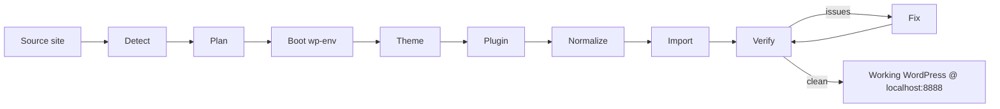

<div align="center">


**Migrate any codebase to WordPress — powered by GitHub Copilot CLI.**

Point it at a Jekyll, Hugo, Eleventy, Ghost, Gatsby, Next, or plain-HTML site.
Walk away. Come back to a fully working, pixel-close WordPress under
[`wp-env`](https://developer.wordpress.org/block-editor/getting-started/devenv/get-started-with-wp-env/)
with a custom theme, a site plugin, imported content and media, preserved
permalinks, and a self-verified build.

[](https://www.npmjs.com/package/to-wordpress)
[](https://www.npmjs.com/package/to-wordpress)
[](./LICENSE)
[](https://nodejs.org)

[Install](#install) · [Quick start](#quick-start) · [How it works](#how-it-works) · [Supported sources](#supported-sources) · [CLI](#cli) · [FAQ](#faq)

</div>

---

## Why

Moving a content-heavy static site to WordPress by hand is a week of
template translation, shortcode rewrites, data shuffling, and URL remapping.
`to-wordpress` collapses that into one command: a deterministic TypeScript
pipeline drives [GitHub Copilot CLI](https://docs.github.com/en/copilot/github-copilot-cli)
(`copilot -p`) in a **hybrid orchestration** — the tool owns phase
transitions, file I/O, and verification; Copilot handles the creative parts
(Liquid → PHP, custom-block generation, edge-case normalization, auto-fix).

What lands in `wp-content/`:

- A bespoke **classic WordPress theme** with `template-parts/…` mirroring
  your source includes one-to-one.
- A **site plugin** owning non-theme concerns — CPTs, newsletter, giscus,
  analytics, cookie banner, redirects, options page.
- Posts, pages, terms, menus, users, featured images — imported via
  `wp-cli` with original permalinks preserved by default.
- A self-written [`WORDPRESS_MIGRATION.md`](#the-migration-doc) that
  documents every decision so you can audit or replay the run.

## Install

`to-wordpress` is meant for one-shot runs, so use `npx` — no global install
needed:

```bash
npx to-wordpress ./path/to/your-site
```

Or install globally if you iterate on the same source:

```bash
npm install -g to-wordpress
to-wordpress ./path/to/your-site
```

### Requirements

- **Node.js ≥ 20**
- **Docker** (for [`wp-env`](https://developer.wordpress.org/block-editor/getting-started/devenv/get-started-with-wp-env/) and the Jekyll prerender container)
- **GitHub Copilot CLI**: `brew install --cask github-copilot-cli` then
  `copilot login`

The tool is self-contained otherwise — no Ruby, no PHP, no wp-cli on the
host. `wp-env` runs WordPress in Docker and the tool talks to wp-cli
through it.

## Quick start

```bash
# 1. Clone or cd into any static site
git clone https://github.com/you/your-jekyll-site
cd your-jekyll-site

# 2. Run the migration (interactive TUI, asks a few URL questions)
npx to-wordpress .

# 3. Open the result
open http://localhost:8888
```

When it finishes you'll have:

```
your-jekyll-site/
├── .wp-env.json              # theme + plugin + content mounted into WordPress
├── WORDPRESS_MIGRATION.md    # the plan + per-phase status + state block
└── WORDPRESS_MIGRATION/
    ├── theme/                # your generated classic theme
    ├── plugin/               # your site plugin
    ├── content/              # canonical markdown for every post & page
    ├── media/                # collected image assets
    ├── rendered/             # Jekyll/Hugo/Eleventy build output (ground truth)
    ├── import-manifest.json  # exact payload fed to wp-cli
    ├── redirects.json        # old-path → new-path map
    └── verify-report.json    # url parity + count diff from the last run
```

Want non-interactive? Add `--yes` (uses defaults for every prompt):

```bash
npx to-wordpress ./my-site --yes
```

## How it works



Every phase is implemented in TypeScript with a deterministic fallback,
then optionally enriched by `copilot -p` running in autopilot mode. Copilot
streams JSONL events back to the tool's **Ink TUI**, which renders a live
phase dashboard, activity log, and approval prompts.

| # | Phase | What it does |
|---|---|---|
| 1 | **Detect** | Probes the source with one [detector per SSG](./src/detectors/). Falls back to a Copilot-driven freestyle detector that reads files and **never skips a folder**. |
| 2 | **Plan** | Produces `WORDPRESS_MIGRATION.md` with a template map, a feature-to-plugin map, the exact permalink structure, and acceptance criteria. |
| 3 | **Boot wp-env** | Writes `.wp-env.json`, mounts your theme + plugin + work dir into WordPress, and runs `npx wp-env start`. |
| 4 | **Theme** | Builds the source site to capture **ground-truth HTML**, mirrors `_sass/`, `assets/`, `_data/`, `_layouts/`, `_includes/` into the theme dir, then drives Copilot to emit PHP templates whose DOM byte-matches the reference. |
| 5 | **Plugin** | Generates a site plugin covering CPTs, newsletter, comments (giscus/disqus/commento), analytics (GA/GTM/Plausible/Umami), cookie banner, dark mode, social meta, redirects, shortcodes, custom blocks, and an options page. |
| 6 | **Normalize** | Turns every post/page into canonical markdown with a fixed front-matter schema. Unusual cases are handed to Copilot with a strict edge-case prompt. |
| 7 | **Import** | Runs a generated PHP script via `wp eval-file` inside the container to upsert posts, terms, menus, users, and media; sets `show_on_front`; populates the primary menu from `_data/menu.yml`. |
| 8 | **Verify** | Counts posts per type with wp-cli, fetches a sample of source URLs from the live WP, and diffs titles, H1s, and HTTP status. Writes `verify-report.json`. |
| 9 | **Fix** | Feeds the verify report back to a scoped Copilot run — minimal surgical edits to theme/plugin/content, idempotent wp-cli calls for data fixes. Re-runs Verify until clean or N iterations. |

## Supported sources

| Source | Confidence | What ships |
|---|---|---|
| Jekyll | 🟢 battle-tested | Posts (`collections/_posts/*.md` + any `collections/<x>/`), pages, layouts, includes, sass, `_data/*`, feature-level detection (giscus, mailchimp, analytics, dark mode, OG/Twitter) |
| Hugo | 🟡 detector + normalizer | Content sections → collections/CPTs, `layouts/**/*.html`, `data/**/*`, `static/` |
| Eleventy | 🟡 detector + normalizer | `src/` or `content/` posts, njk/liquid/hbs layouts |
| Gatsby | 🟡 detector + normalizer | `src/pages/*.{tsx,jsx}` + `content/**/*.md(x)` |
| Next.js | 🟡 detector + normalizer | App/Pages router + `content/` / `posts/` / `blog/` markdown |
| Ghost export | 🟡 detector + normalizer | Ghost JSON dump (`posts`, `tags`, `users`) |
| Plain HTML | 🟢 fallback | Every `.html` file as a page, every `.md` file as a post |
| **Anything else** | 🟢 freestyle | Deterministic file walker + Copilot-driven schema fill — never skips a folder |

Adding a new built-in detector is ~60 lines — drop a file in
[`src/detectors/`](./src/detectors/), implement `match()` + `detect()`,
register it in [`src/detectors/index.ts`](./src/detectors/index.ts).

## CLI

```
Usage: to-wordpress [options] [source]

Migrate any codebase to WordPress. Hybrid orchestration with GitHub Copilot CLI.

Arguments:
  source                    path to the source site to migrate (default: ".")

Options:
  -v, --version             print version
  --skip-boot               skip wp-env start (assumes already running)
  --skip-copilot            use deterministic fallbacks only, don't invoke copilot
  -y, --yes                 auto-answer all prompts with defaults
  --only <phase>            run only this phase (advanced)
  --from <phase>            start from this phase (skip earlier ones)
  --until <phase>           stop after this phase (skip later ones)
  --max-fix-iterations <n>  max Verify→Fix iterations (default: 3)
  -h, --help                display help
```

`<phase>` is one of: `detect`, `plan`, `boot`, `theme`, `plugin`,
`normalize`, `import`, `verify`, `fix`.

### Re-running just the theme

Iterating on theme fidelity? The state is persisted inside
`WORDPRESS_MIGRATION.md`, so you can resume any later phase:

```bash
npx to-wordpress ./my-site --yes --from theme --skip-boot
```

### Non-interactive in CI

```bash
npx to-wordpress ./my-site --yes --skip-copilot --until normalize
```

Skipping Copilot means every Copilot-driven step uses the deterministic
fallback — you still get detect, plan, normalize, and import, just without
the pixel-perfect theme transforms.

## The migration doc

`to-wordpress` writes a live, human-readable
[`WORDPRESS_MIGRATION.md`](./WORDPRESS_MIGRATION.example.md) inside your
source repo. It contains:

- The phase table with status + timestamps.
- Overview of the migration and permalink strategy.
- A template-mapping table (every source layout/include → WP file).
- A feature-to-output mapping (theme vs plugin vs external plugin).
- Risks & open questions.
- Acceptance criteria the Verify phase checks against.
- A `WPIFY:STATE` JSON block at the bottom the tool reads back on resume.

You can commit this file — re-running `to-wordpress` updates it in place
rather than re-planning from scratch.

## Prompts

Every Copilot-driven phase runs with a rigorously structured prompt in
[`src/prompts/`](./src/prompts). A shared preamble ([`_shared.md`](./src/prompts/_shared.md))
gives every phase the same autonomy + fidelity contract; each phase adds:

- Explicit **Scope** (which dirs may be written).
- Explicit **Required output** (every file that must exist).
- **Non-negotiable rules** (e.g. _never `esc_html(get_the_title())` in a template_).
- Banned **anti-patterns** (no TODOs, no Lorem ipsum, no hard-coded
  localhost URLs, no silenced PHP errors).
- A **self-check** the model walks before stopping.

The prompts are intentionally opinionated about WordPress best practices:
escaping, text-domain consistency, activation hooks, idempotent wp-cli,
options API, rewrite rules.

## FAQ

**Is my data safe?** The tool writes everything under `WORDPRESS_MIGRATION/`
inside your source repo and to a local `wp-env` Docker volume. No network
calls except to the GitHub Copilot API and Docker Hub. Nothing is sent to
your live WordPress until you decide to deploy the generated theme/plugin.

**Why `wp-env`?** It pins WordPress + PHP versions, runs wp-cli in-container,
and tears down cleanly. You can export the database afterwards with
`npx wp-env run cli wp db export`.

**What about pixel-perfect?** The theme phase builds your Jekyll/Hugo site
into HTML first (inside a Ruby 3.2 container so host Ruby version doesn't
matter), then feeds that ground-truth DOM to Copilot as the exact target.
Verify re-fetches your local WP and diffs structure + titles + status —
any drift goes back to a scoped Fix loop.

**Can I use a live WordPress instead of wp-env?** Not yet — the import
uses `wp eval-file` inside the `wp-env` cli container. Remote
WP-via-REST-API is a planned target.

**Does it migrate comments?** Comments stay wherever they live
(giscus/disqus/commento). The plugin re-attaches the same integration in
WordPress so threads keep working.

**What's the Copilot bill?** Expect 3–5 Copilot sessions per full run
(plan, theme, plugin, per-post normalize edge cases, fix loop). A
~40-post Jekyll site runs in ~20 minutes end-to-end.

## Development

```bash
git clone https://github.com/f/to-wordpress
cd to-wordpress
npm install
npm run build
node dist/cli.js ./fixtures/unknown --skip-boot --skip-copilot --yes --until normalize
```

Run type checks and build in watch mode:

```bash
npm run typecheck
npm run dev
```

The codebase is:

- [`src/cli.tsx`](./src/cli.tsx) — commander entry + Ink TUI bootstrap.
- [`src/copilot/run.ts`](./src/copilot/run.ts) — spawn `copilot -p`, parse JSONL events.
- [`src/detectors/`](./src/detectors/) — one detector per SSG + freestyle fallback.
- [`src/phases/`](./src/phases/) — one file per phase.
- [`src/prompts/`](./src/prompts/) — markdown templates + loader.
- [`src/tui/`](./src/tui/) — Ink app, event bus, headless logger.
- [`src/wp/`](./src/wp/) — thin wrappers around `npx wp-env` and `wp-cli`.

PRs welcome — especially new detectors, new Copilot prompts for specific
frameworks, and verify rules that catch more drift.

## License

[MIT](./LICENSE) © Fatih Kadir Akın
